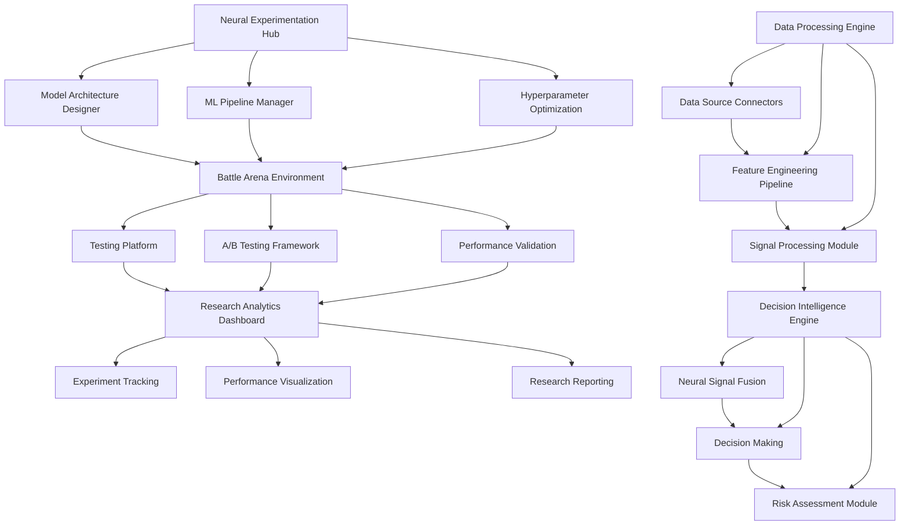

# AXON - Neural Research Framework
## Product Requirements Document

## 1. Product Overview

AXON is a neural research framework and AI experimentation platform designed for artificial intelligence research in quantitative finance. The system combines machine learning pipelines, data processing, and modular architecture to create a research environment for neural network experimentation, signal processing, and decision-making systems.

The platform serves as a foundation for AI researchers, data scientists, and technology innovators who need a scalable environment for developing and testing neural architectures for financial applications - from market analysis to trading strategies, from pattern recognition to predictive analytics.

AXON provides research tools and methodologies that can be adapted for various quantitative finance research requiring intelligent automation and decision-making capabilities.

## 2. Core Features

### 2.1 User Roles

| Role | Registration Method | Core Permissions |
|------|---------------------|------------------|
| Research Scientist | Academic/Corporate credentials | Full access to neural experiments, model development, data analysis |
| Data Engineer | Technical certification | Data pipeline management, feature engineering, system monitoring |
| AI Architect | Senior-level validation | System architecture, model deployment, infrastructure scaling |
| Observer | Read-only access | View experiments, access reports, monitor performance metrics |

### 2.2 Feature Module

Our neural research laboratory consists of the following main components:

1. **Neural Experimentation Hub**: ML pipeline management, model ensemble orchestration, hyperparameter optimization
2. **Data Processing Engine**: Multi-source data ingestion, feature engineering pipeline, signal processing and normalization
3. **Battle Arena Testing Environment**: Experimentation platform, A/B testing framework, performance validation system
4. **Decision Intelligence Engine**: Neural signal fusion, decision-making, risk assessment and optimization
5. **Research Analytics Dashboard**: Experiment tracking, performance visualization, research insights and reporting
6. **Configuration Management Center**: System parameters, model configurations, deployment settings
7. **Documentation and Knowledge Base**: Technical documentation, research findings, best practices repository

### 2.3 Page Details

| Page Name | Module Name | Feature description |
|-----------|-------------|---------------------|
| Neural Experimentation Hub | ML Pipeline Manager | Create, configure, and manage machine learning experiments with model selection and ensemble optimization |
| Neural Experimentation Hub | Model Architecture Designer | Design neural network architectures with interface and validation |
| Neural Experimentation Hub | Hyperparameter Optimization | Hyperparameter tuning using Bayesian optimization, grid search, and evolutionary algorithms |
| Data Processing Engine | Data Source Connectors | Connect to multiple data sources (APIs, databases, streams) with data ingestion capabilities |
| Data Processing Engine | Feature Engineering Pipeline | Feature extraction, transformation, and selection with technical indicators |
| Data Processing Engine | Signal Processing Module | Signal processing, noise reduction, pattern detection, and data normalization |
| Battle Arena Environment | Testing Platform | Deploy models in controlled environment with performance monitoring |
| Battle Arena Environment | A/B Testing Framework | Compare multiple models simultaneously with statistical significance testing |
| Battle Arena Environment | Performance Validation | Model validation with backtesting, forward testing, and stress testing |
| Decision Intelligence Engine | Neural Signal Fusion | Combine multiple neural network outputs using ensemble techniques |
| Decision Intelligence Engine | Decision Making | Decision-making system that adapts to changing conditions and feedback |
| Decision Intelligence Engine | Risk Assessment Module | Risk analysis with monitoring and safeguards |
| Research Analytics Dashboard | Experiment Tracking | Track all experiments with detailed metrics, visualizations, and comparative analysis |
| Research Analytics Dashboard | Performance Visualization | Interactive charts, graphs, and dashboards for model performance and research insights |
| Research Analytics Dashboard | Research Reporting | Automated report generation with statistical analysis and research findings |
| Configuration Management | System Configuration | Manage system-wide settings, API configurations, and deployment parameters |
| Configuration Management | Model Configuration | Configure model parameters, training settings, and deployment specifications |
| Configuration Management | Security Settings | Manage access controls, API keys, and security protocols |
| Documentation Hub | Technical Documentation | Comprehensive technical guides, API documentation, and system architecture |
| Documentation Hub | Research Knowledge Base | Repository of research findings, best practices, and experimental results |
| Documentation Hub | Tutorial Center | Step-by-step tutorials for different use cases and research methodologies |

## 3. Core Process

### Research Scientist Flow
1. **Access Neural Experimentation Hub** → Configure new research experiment with custom parameters
2. **Design Model Architecture** → Create or select neural network architectures for the specific research domain
3. **Configure Data Pipeline** → Set up data ingestion and feature engineering for the experiment
4. **Deploy to Battle Arena** → Launch testing environment to validate model performance
5. **Monitor Performance** → Track experiment progress through Research Analytics Dashboard
6. **Analyze Results** → Generate comprehensive reports and extract research insights
7. **Iterate and Optimize** → Refine models based on results and deploy improved versions

### Data Engineer Flow
1. **Access Data Processing Engine** → Configure data sources and ingestion pipelines
2. **Design Feature Pipeline** → Create automated feature engineering workflows
3. **Monitor Data Quality** → Ensure data integrity and processing performance
4. **Optimize Performance** → Fine-tune data processing for maximum efficiency
5. **Collaborate with Scientists** → Support research experiments with robust data infrastructure

### AI Architect Flow
1. **System Architecture Design** → Configure overall system architecture and scaling parameters
2. **Model Deployment Strategy** → Design deployment pipelines and infrastructure requirements
3. **Performance Optimization** → Optimize system performance and resource utilization
4. **Security Implementation** → Implement security protocols and access controls
5. **Infrastructure Scaling** → Scale system resources based on research demands

## 4. User Interface Design

### 4.1 Design Style

- **Primary Colors**: Deep Neural Blue (#1a237e), Research Green (#2e7d32), Innovation Orange (#f57c00)
- **Secondary Colors**: Clean White (#ffffff), Professional Gray (#424242), Accent Silver (#90a4ae)
- **Button Style**: Modern flat design with subtle shadows and hover animations
- **Typography**: Roboto for headers (16-24px), Open Sans for body text (12-16px), Fira Code for code blocks
- **Layout Style**: Card-based modular design with responsive grid system and clean navigation
- **Icon Style**: Material Design icons with custom neural network and research-themed illustrations
- **Animation**: Smooth transitions, data visualization animations, and interactive feedback elements

### 4.2 Page Design Overview

| Page Name | Module Name | UI Elements |
|-----------|-------------|-------------|
| Neural Experimentation Hub | ML Pipeline Manager | Dashboard with neural network visualization, model builder, training progress bars, parameter sliders |
| Neural Experimentation Hub | Model Architecture Designer | Neural network designer with node-based interface, layer configuration panels, architecture templates gallery |
| Data Processing Engine | Data Source Connectors | Connection status indicators, data flow visualizations, data preview tables, configuration wizards |
| Data Processing Engine | Feature Engineering Pipeline | Pipeline flow diagrams, feature importance charts, transformation preview panels, suggestions |
| Battle Arena Environment | Testing Platform | Performance metrics, model comparison tables, interactive charts, alert notifications |
| Battle Arena Environment | A/B Testing Framework | Statistical significance indicators, performance comparison charts, test configuration panels |
| Decision Intelligence Engine | Neural Signal Fusion | Signal strength visualizations, ensemble weight displays, decision confidence meters, risk heat maps |
| Research Analytics Dashboard | Experiment Tracking | Interactive experiment timeline, performance trend charts, model comparison matrices, detailed metrics tables |
| Research Analytics Dashboard | Performance Visualization | Customizable dashboards, interactive charts (D3.js), data updates, export capabilities |
| Configuration Management | System Configuration | Tabbed configuration panels, validation indicators, backup/restore options, security status displays |
| Documentation Hub | Technical Documentation | Searchable documentation tree, code syntax highlighting, interactive examples, version control |

### 4.3 Responsiveness

The AXON platform is designed with a desktop-first approach optimized for research environments, featuring adaptive layouts for tablets and mobile devices. The interface includes touch-friendly controls for mobile access, responsive data visualizations that scale across devices, and optimized performance for high-resolution displays commonly used in research settings.
