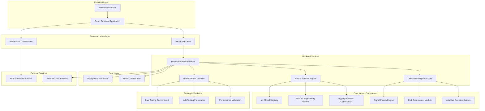
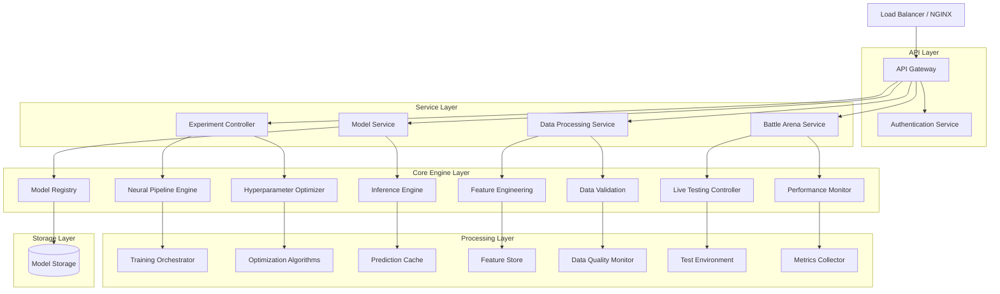
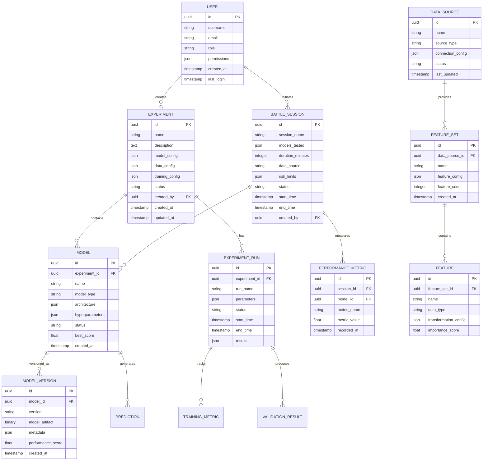

# AXON - Neural Research Framework
## Technical Architecture Document

## 1. Architecture Design



## 2. Technology Description

- **Frontend**: React@18 + TypeScript + TailwindCSS + Vite + D3.js (for data visualization)
- **Backend**: Python@3.11 + FastAPI + WebSockets + Celery (for async tasks)
- **Neural Pipeline**: PyTorch + Scikit-learn + XGBoost + LightGBM + Optuna (hyperparameter optimization)
- **Database**: PostgreSQL@15 (primary data) + Redis@7 (caching & real-time data)
- **Data Processing**: Pandas + NumPy + Apache Kafka (streaming) + Apache Airflow (orchestration)
- **Monitoring**: Prometheus + Grafana + MLflow (experiment tracking)
- **Infrastructure**: Docker + Kubernetes + NGINX (load balancing)

## 3. Route Definitions

| Route | Purpose |
|-------|---------|
| `/` | Main research dashboard with overview of active experiments and system status |
| `/experiments` | Neural experimentation hub for creating and managing ML experiments |
| `/experiments/:id` | Detailed view of specific experiment with real-time metrics and controls |
| `/models` | Model architecture designer and model registry management |
| `/models/:id/edit` | Interactive model architecture editor with visual design tools |
| `/data` | Real-time data processing engine configuration and monitoring |
| `/data/sources` | Data source connector management and configuration |
| `/data/features` | Feature engineering pipeline designer and monitoring |
| `/battle-arena` | Live testing environment for model validation and A/B testing |
| `/battle-arena/live` | Real-time battle arena with live model performance monitoring |
| `/battle-arena/results` | Historical battle results and performance analysis |
| `/decision-engine` | Decision intelligence configuration and signal fusion management |
| `/analytics` | Research analytics dashboard with experiment tracking and visualization |
| `/analytics/experiments` | Experiment comparison and analysis tools |
| `/analytics/performance` | Performance metrics visualization and reporting |
| `/config` | System configuration management and security settings |
| `/config/models` | Model configuration templates and deployment settings |
| `/config/security` | Security protocols, API keys, and access control management |
| `/docs` | Technical documentation and research knowledge base |
| `/docs/api` | Interactive API documentation with live examples |
| `/docs/tutorials` | Step-by-step tutorials and research methodologies |

## 4. API Definitions

### 4.1 Core Neural Pipeline API

**Experiment Management**
```
POST /api/v1/experiments
```

Request:
| Param Name | Param Type | isRequired | Description |
|------------|------------|------------|-------------|
| name | string | true | Experiment name and identifier |
| description | string | false | Detailed experiment description |
| model_config | object | true | Model architecture and parameters |
| data_config | object | true | Data source and feature configuration |
| training_config | object | true | Training parameters and optimization settings |

Response:
| Param Name | Param Type | Description |
|------------|------------|-------------|
| experiment_id | string | Unique experiment identifier |
| status | string | Current experiment status (created, running, completed, failed) |
| created_at | datetime | Experiment creation timestamp |

Example:
```json
{
  "name": "Neural Signal Processing v2.1",
  "description": "LSTM-based signal processing with attention mechanism",
  "model_config": {
    "type": "lstm_attention",
    "layers": [128, 64, 32],
    "dropout": 0.2,
    "attention_heads": 8
  },
  "data_config": {
    "sources": ["binance_ws", "market_data_api"],
    "features": ["price_momentum", "volume_profile", "technical_indicators"],
    "timeframe": "1m"
  },
  "training_config": {
    "epochs": 100,
    "batch_size": 256,
    "learning_rate": 0.001,
    "optimizer": "adam"
  }
}
```

**Real-time Model Inference**
```
POST /api/v1/models/{model_id}/predict
```

Request:
| Param Name | Param Type | isRequired | Description |
|------------|------------|------------|-------------|
| input_data | array | true | Input feature vector for prediction |
| confidence_threshold | float | false | Minimum confidence threshold for prediction |
| return_features | boolean | false | Whether to return feature importance |

Response:
| Param Name | Param Type | Description |
|------------|------------|-------------|
| prediction | float | Model prediction value |
| confidence | float | Prediction confidence score (0-1) |
| feature_importance | object | Feature importance scores (if requested) |
| processing_time_ms | integer | Inference processing time in milliseconds |

**Battle Arena Management**
```
POST /api/v1/battle-arena/sessions
```

Request:
| Param Name | Param Type | isRequired | Description |
|------------|------------|------------|-------------|
| models | array | true | List of model IDs to test |
| test_duration | integer | true | Test duration in minutes |
| data_source | string | true | Data source for live testing |
| risk_limits | object | true | Risk management parameters |

Response:
| Param Name | Param Type | Description |
|------------|------------|-------------|
| session_id | string | Battle arena session identifier |
| status | string | Session status (active, paused, completed) |
| start_time | datetime | Session start timestamp |
| models_status | object | Individual model status and performance |

### 4.2 Data Processing API

**Feature Engineering Pipeline**
```
POST /api/v1/features/pipeline
```

Request:
| Param Name | Param Type | isRequired | Description |
|------------|------------|------------|-------------|
| data_source | string | true | Source data identifier |
| transformations | array | true | List of feature transformations to apply |
| output_format | string | false | Output data format (json, parquet, csv) |

Response:
| Param Name | Param Type | Description |
|------------|------------|-------------|
| pipeline_id | string | Feature pipeline identifier |
| features_generated | integer | Number of features generated |
| processing_status | string | Pipeline processing status |

### 4.3 Analytics and Monitoring API

**Experiment Analytics**
```
GET /api/v1/analytics/experiments/{experiment_id}
```

Response:
| Param Name | Param Type | Description |
|------------|------------|-------------|
| performance_metrics | object | Comprehensive performance statistics |
| training_history | array | Training loss and accuracy history |
| feature_importance | object | Feature importance rankings |
| model_diagnostics | object | Model health and diagnostic information |

## 5. Server Architecture Diagram



## 6. Data Model

### 6.1 Data Model Definition



### 6.2 Data Definition Language

**Experiment Management Tables**
```sql
-- Create experiments table
CREATE TABLE experiments (
    id UUID PRIMARY KEY DEFAULT gen_random_uuid(),
    name VARCHAR(255) NOT NULL,
    description TEXT,
    model_config JSONB NOT NULL,
    data_config JSONB NOT NULL,
    training_config JSONB NOT NULL,
    status VARCHAR(50) DEFAULT 'created' CHECK (status IN ('created', 'running', 'completed', 'failed', 'paused')),
    created_by UUID NOT NULL,
    created_at TIMESTAMP WITH TIME ZONE DEFAULT NOW(),
    updated_at TIMESTAMP WITH TIME ZONE DEFAULT NOW()
);

-- Create models table
CREATE TABLE models (
    id UUID PRIMARY KEY DEFAULT gen_random_uuid(),
    experiment_id UUID NOT NULL REFERENCES experiments(id) ON DELETE CASCADE,
    name VARCHAR(255) NOT NULL,
    model_type VARCHAR(100) NOT NULL,
    architecture JSONB NOT NULL,
    hyperparameters JSONB NOT NULL,
    status VARCHAR(50) DEFAULT 'training' CHECK (status IN ('training', 'trained', 'deployed', 'archived')),
    best_score FLOAT,
    created_at TIMESTAMP WITH TIME ZONE DEFAULT NOW()
);

-- Create model_versions table
CREATE TABLE model_versions (
    id UUID PRIMARY KEY DEFAULT gen_random_uuid(),
    model_id UUID NOT NULL REFERENCES models(id) ON DELETE CASCADE,
    version VARCHAR(50) NOT NULL,
    model_artifact BYTEA,
    metadata JSONB,
    performance_score FLOAT,
    created_at TIMESTAMP WITH TIME ZONE DEFAULT NOW(),
    UNIQUE(model_id, version)
);

-- Create experiment_runs table
CREATE TABLE experiment_runs (
    id UUID PRIMARY KEY DEFAULT gen_random_uuid(),
    experiment_id UUID NOT NULL REFERENCES experiments(id) ON DELETE CASCADE,
    run_name VARCHAR(255) NOT NULL,
    parameters JSONB NOT NULL,
    status VARCHAR(50) DEFAULT 'running' CHECK (status IN ('running', 'completed', 'failed', 'cancelled')),
    start_time TIMESTAMP WITH TIME ZONE DEFAULT NOW(),
    end_time TIMESTAMP WITH TIME ZONE,
    results JSONB
);

-- Create battle_sessions table
CREATE TABLE battle_sessions (
    id UUID PRIMARY KEY DEFAULT gen_random_uuid(),
    session_name VARCHAR(255) NOT NULL,
    models_tested JSONB NOT NULL,
    duration_minutes INTEGER NOT NULL,
    data_source VARCHAR(255) NOT NULL,
    risk_limits JSONB NOT NULL,
    status VARCHAR(50) DEFAULT 'active' CHECK (status IN ('active', 'paused', 'completed', 'cancelled')),
    start_time TIMESTAMP WITH TIME ZONE DEFAULT NOW(),
    end_time TIMESTAMP WITH TIME ZONE,
    created_by UUID NOT NULL
);

-- Create performance_metrics table
CREATE TABLE performance_metrics (
    id UUID PRIMARY KEY DEFAULT gen_random_uuid(),
    session_id UUID NOT NULL REFERENCES battle_sessions(id) ON DELETE CASCADE,
    model_id UUID NOT NULL REFERENCES models(id) ON DELETE CASCADE,
    metric_name VARCHAR(100) NOT NULL,
    metric_value FLOAT NOT NULL,
    recorded_at TIMESTAMP WITH TIME ZONE DEFAULT NOW()
);

-- Create users table
CREATE TABLE users (
    id UUID PRIMARY KEY DEFAULT gen_random_uuid(),
    username VARCHAR(100) UNIQUE NOT NULL,
    email VARCHAR(255) UNIQUE NOT NULL,
    role VARCHAR(50) DEFAULT 'researcher' CHECK (role IN ('researcher', 'data_engineer', 'ai_architect', 'observer')),
    permissions JSONB DEFAULT '{}',
    created_at TIMESTAMP WITH TIME ZONE DEFAULT NOW(),
    last_login TIMESTAMP WITH TIME ZONE
);

-- Create data_sources table
CREATE TABLE data_sources (
    id UUID PRIMARY KEY DEFAULT gen_random_uuid(),
    name VARCHAR(255) NOT NULL,
    source_type VARCHAR(100) NOT NULL,
    connection_config JSONB NOT NULL,
    status VARCHAR(50) DEFAULT 'active' CHECK (status IN ('active', 'inactive', 'error')),
    last_updated TIMESTAMP WITH TIME ZONE DEFAULT NOW()
);

-- Create feature_sets table
CREATE TABLE feature_sets (
    id UUID PRIMARY KEY DEFAULT gen_random_uuid(),
    data_source_id UUID NOT NULL REFERENCES data_sources(id) ON DELETE CASCADE,
    name VARCHAR(255) NOT NULL,
    feature_config JSONB NOT NULL,
    feature_count INTEGER DEFAULT 0,
    created_at TIMESTAMP WITH TIME ZONE DEFAULT NOW()
);

-- Create features table
CREATE TABLE features (
    id UUID PRIMARY KEY DEFAULT gen_random_uuid(),
    feature_set_id UUID NOT NULL REFERENCES feature_sets(id) ON DELETE CASCADE,
    name VARCHAR(255) NOT NULL,
    data_type VARCHAR(50) NOT NULL,
    transformation_config JSONB,
    importance_score FLOAT DEFAULT 0.0
);

-- Create indexes for performance optimization
CREATE INDEX idx_experiments_created_by ON experiments(created_by);
CREATE INDEX idx_experiments_status ON experiments(status);
CREATE INDEX idx_experiments_created_at ON experiments(created_at DESC);

CREATE INDEX idx_models_experiment_id ON models(experiment_id);
CREATE INDEX idx_models_status ON models(status);
CREATE INDEX idx_models_best_score ON models(best_score DESC);

CREATE INDEX idx_model_versions_model_id ON model_versions(model_id);
CREATE INDEX idx_model_versions_created_at ON model_versions(created_at DESC);

CREATE INDEX idx_experiment_runs_experiment_id ON experiment_runs(experiment_id);
CREATE INDEX idx_experiment_runs_status ON experiment_runs(status);
CREATE INDEX idx_experiment_runs_start_time ON experiment_runs(start_time DESC);

CREATE INDEX idx_battle_sessions_created_by ON battle_sessions(created_by);
CREATE INDEX idx_battle_sessions_status ON battle_sessions(status);
CREATE INDEX idx_battle_sessions_start_time ON battle_sessions(start_time DESC);

CREATE INDEX idx_performance_metrics_session_id ON performance_metrics(session_id);
CREATE INDEX idx_performance_metrics_model_id ON performance_metrics(model_id);
CREATE INDEX idx_performance_metrics_recorded_at ON performance_metrics(recorded_at DESC);

CREATE INDEX idx_features_feature_set_id ON features(feature_set_id);
CREATE INDEX idx_features_importance_score ON features(importance_score DESC);

-- Insert initial data for system setup
INSERT INTO users (username, email, role, permissions) VALUES
('admin', 'admin@axon-lab.ai', 'ai_architect', '{"full_access": true, "system_admin": true}'),
('researcher_demo', 'researcher@axon-lab.ai', 'researcher', '{"experiments": true, "models": true, "analytics": true}'),
('data_engineer_demo', 'data@axon-lab.ai', 'data_engineer', '{"data_sources": true, "features": true, "monitoring": true}');

INSERT INTO data_sources (name, source_type, connection_config, status) VALUES
('Demo Market Data', 'websocket', '{"url": "wss://demo-api.example.com", "auth_required": false}', 'active'),
('Research Dataset', 'file', '{"path": "/data/research/", "format": "parquet"}', 'active'),
('External API', 'rest_api', '{"base_url": "https://api.example.com", "rate_limit": 1000}', 'inactive');
```